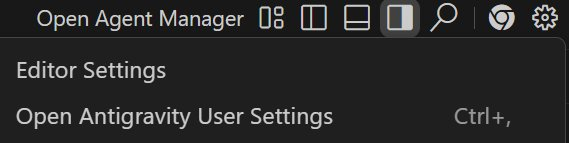
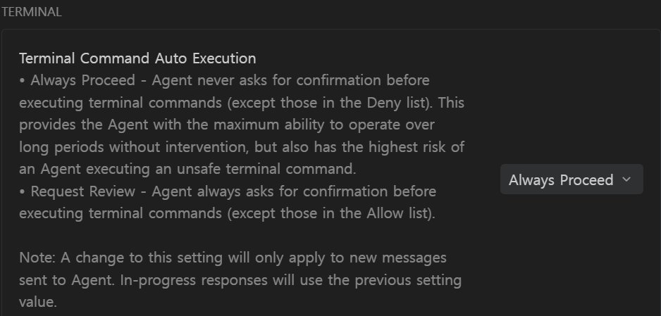

# Antigravity 환경 세팅 가이드
## Rules · Skills · MCP 한 번에 설치하기

> 이 가이드는 3주차 실습 전에 한 번만 하면 됩니다.  
> 설치는 파일 실행 한 번으로 끝납니다.

---

## 먼저 — 이게 뭔가요?

Antigravity를 처음 설치하면 AI가 **아무것도 모르는 상태**입니다.  
뭘 도와달라고 하면 대충 도와주긴 하는데, 우리 강의 환경에 맞게 행동하진 않습니다.

이 세팅은 AI에게 세 가지를 알려주는 작업입니다.

| 항목 | 한 줄 설명 | 비유 |
|------|-----------|------|
| **Rules** | "항상 이렇게 행동해" | 신입사원 복무규정 |
| **Skills** | "이 상황엔 이렇게 해" | 업무 매뉴얼 서랍 |
| **MCP** | "이 도구를 쓸 수 있어" | 외부 데이터베이스 연결 |

---

## Rules — 항상 켜져 있는 규칙

Rules는 AI가 **모든 대화에서 항상 따르는 기본 행동 원칙**입니다.

```
Rules가 없으면:  "코드 짜줘" → 영어로 설명, 가상환경 무시, API 키 하드코딩
Rules가 있으면:  "코드 짜줘" → 한국어 설명, 가상환경 먼저 확인, .env 파일 사용
```

우리 강의 Rules에 포함된 주요 내용:

- 모든 응답은 한국어로
- 새 프로젝트 시작 시 가상환경 생성 필수
- API 키는 절대 코드에 직접 쓰지 않기 (`.env` 파일 사용)
- 에러 나면 원인부터 파악하고 수정
- 기존 파일 삭제 전에 반드시 확인 요청

---

## Skills — 상황에 맞게 꺼내 쓰는 매뉴얼

Skills는 Rules와 다릅니다. **항상 켜져 있지 않고, 관련 상황이 되면 그때 꺼내 읽습니다.**

```
Rules:   AI가 항상 기억하고 있음 (복무규정)
Skills:  필요할 때만 참고함 (업무 매뉴얼 서랍에서 꺼내기)
```

왜 이렇게 나눌까요?  
AI의 작업 공간(컨텍스트 창)은 무한하지 않습니다. 항상 모든 걸 기억하면 정작 중요한 대화 내용을 잊어버립니다. 그래서 자주 안 쓰는 전문 지식은 필요할 때만 불러오는 방식을 씁니다.

우리 강의에 설치되는 Skills:

| Skill | 언제 발동되나 | 하는 일 |
|-------|-------------|---------|
| `python-project` | "새 프로젝트", "폴더 만들어줘", `pip install` | 가상환경 생성 → 활성화 → requirements.txt 관리 순서 안내 |
| `git-commit` | "커밋해줘", "push", "git 작업" | 커밋 메시지 형식, `.env` 스테이징 방지, 순서 안내 |
| `context7-usage` | "LLM 연동", "Gemini API", "AI 분석 버튼" | 최신 공식 문서 조회 후 코드 작성, 구버전 모델명 사용 방지 |
| `debug-workflow` | 에러 메시지 붙여넣기, "에러가 났어" | 원인 → 해결 → 예방 순서로 분석 |

---

## MCP — AI가 쓸 수 있는 외부 도구

MCP(Model Context Protocol)는 AI에게 **인터넷이나 외부 서비스에 접근하는 능력**을 줍니다.

우리 강의에서는 **Context7** 하나만 씁니다.

### Context7이 왜 필요한가?

AI의 지식에는 **학습 마감일**이 있습니다.  
Gemini API를 쓰는 코드를 짜달라고 하면, AI는 기억 속의 예전 문서를 기반으로 코드를 씁니다.  
그런데 그 사이에 패키지가 업데이트되어 함수 이름이 바뀌었다면? 실행하자마자 에러가 납니다.

```
Context7 없을 때:
  AI의 기억 (수개월~1년 전 학습 데이터) → 구버전 코드 → 에러

Context7 있을 때:
  AI → Context7 → 오늘 기준 공식 문서 조회 → 최신 코드
```

**API 키가 필요 없어서** 설치 파일에 설정이 자동으로 포함되어 있습니다. 따로 준비할 것이 없습니다.

---

## 설치하기

강의 자료 폴더 안에 `antigravity-config` 폴더가 있습니다.

```
vibe-coding/
└── antigravity-config/
    ├── install.bat       ← Windows용
    ├── install.sh        ← Mac / Linux용
    ├── GEMINI.md         (Rules 파일)
    ├── mcp_config.json   (MCP 설정 파일)
    └── skills/           (Skills 폴더)
```

---

### Windows 사용자

탐색기에서 `antigravity-config` 폴더로 이동한 뒤  
**`install.bat` 파일을 더블클릭**합니다.

```
설치 화면 예시:

🚀 Antigravity 설정 설치를 시작합니다...
✅ GEMINI.md 설치 완료
✅ mcp_config.json 설치 완료
✅ Skills/python-project 설치 완료
✅ Skills/git-commit 설치 완료
✅ Skills/context7-usage 설치 완료
✅ Skills/debug-workflow 설치 완료

🎉 설치 완료! Antigravity를 재시작해주세요.
```

---

### Mac / Linux 사용자

터미널을 열고 아래 명령어를 실행합니다.

```bash
cd 강의폴더경로/antigravity-config
bash install.sh
```

완료 메시지가 뜨면 끝입니다.

---

## 설치 후 확인

Antigravity를 **완전히 종료했다가 다시 시작**합니다.

새 대화를 열고 아래 문장을 입력해보세요:

```
Python 프로젝트 새로 시작하려고 해. 폴더 만들어줘.
```

AI가 가상환경 생성부터 안내한다면 설치가 정상적으로 된 것입니다.

---

## Antigravity 추가 설정 (권장)

설치 스크립트와 별개로, Antigravity 앱에서 직접 해주면 좋은 설정이 두 가지 있습니다.  
AI가 터미널 명령을 실행할 때마다 일일이 승인을 눌러야 하는 불편함을 없애줍니다.

---

### 1. Auto Accept 익스텐션 설치

Antigravity에는 터미널 명령 실행 전 "Run command?" 확인창이 뜨는 버그가 있습니다.  
설정을 자동 실행으로 바꿔도 계속 물어보는 경우가 많아서, 이를 해결하는 익스텐션을 설치합니다.

**익스텐션 패널 열기**

에디터 왼쪽 사이드바에서 아래 아이콘을 클릭합니다.


검색창에 아래를 입력합니다:

```
antigravity-auto-accept
```

또는 브라우저에서 직접 설치:
> [open-vsx.org/extension/pesosz/antigravity-auto-accept](https://open-vsx.org/extension/pesosz/antigravity-auto-accept)

---

### 2. Terminal Command Auto Execution 설정

**설정 열기**

우측 상단 톱니바퀴 아이콘 클릭 → **Open Antigravity User Settings** (`Ctrl+,`)



**Terminal 섹션에서 변경**

`Terminal Command Auto Execution` 항목을 **Always Proceed** 로 변경합니다.



| 옵션 | 동작 |
|------|------|
| **Always Proceed** | Deny list에 없는 명령은 전부 자동 실행 |
| Request Review | 모든 명령 실행 전 승인 요청 |

> **Deny list란?**  
> "이것만큼은 자동 실행하지 마라"는 명령어를 직접 등록하는 목록입니다.  
> **기본값은 비어있습니다** — 필요에 따라 직접 추가하면 됩니다.  
> 예: `rm -rf`, `del /f /s` 같은 대량 삭제 명령을 넣어두면 안전합니다.

> **Planning 검토는 그대로 유지하세요.**  
> Terminal 자동 실행과 Plan 검토는 별개 설정입니다.  
> "AI가 뭘 할지"는 계획 단계에서 확인하고, "어떻게 실행할지"는 자동으로 두는 게 좋은 균형입니다.

---

## 자주 묻는 질문

**Q. 설치 후에도 AI가 영어로 대답해요.**  
→ Antigravity를 완전히 재시작했는지 확인하세요. 트레이 아이콘에서 완전 종료 후 재실행해야 합니다.

**Q. `install.bat` 더블클릭했는데 창이 바로 꺼져요.**  
→ 정상입니다. 설치가 순식간에 끝나서 창이 닫힌 것입니다. 위의 확인 방법으로 정상 설치 여부를 체크하세요.

**Q. "GEMINI.md가 이미 존재합니다"라고 나와요.**  
→ 이전에 설치한 적이 있는 것입니다. `y`를 입력하면 강의 최신 버전으로 업데이트됩니다.

**Q. Skills는 제가 직접 불러와야 하나요?**  
→ 아닙니다. AI가 대화 내용을 보고 자동으로 판단해서 필요한 Skill을 꺼냅니다.  
"python-project Skill 써줘"처럼 직접 말하지 않아도 됩니다.

**Q. 강의 중간에 Skills가 업데이트되면 어떻게 하나요?**  
→ `install.bat`(또는 `install.sh`)을 다시 실행하면 됩니다.  
Skills는 자동으로 최신 버전으로 덮어써집니다.
