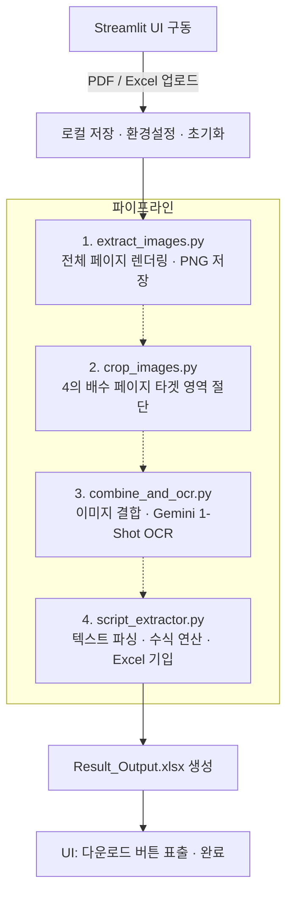

# Week 5 — PDF 문서 처리

> **이번 주 목표:** PDF에서 원하는 것을 꺼내는 방법을 익힌다. 문서 구조를 파악하고 목적에 맞는 추출 방식을 선택하는 것이 핵심이며, LLM을 활용한 OCR 파이프라인은 그 대표 예시 중 하나다.

---

## Example 5-A — 공개 논문 PDF → Markdown → 번역 → DOCX

## 전체 흐름 한눈에 보기

이번 주 실습은 세 개의 스크립트가 파이프라인처럼 연결됩니다.

```
[PDF 논문]
    │
    ▼  process_pdf.py
[페이지별 PNG 렌더링]  ─→  Gemini OCR  ─→  output.md
                                               │
                                               ▼  translate_md.py
                                        [용어집 추출]  (1회)
                                               │
                                        [페이지별 번역]  (페이지 수만큼)
                                               │
                                          output_ko.md
                                               │
                                               ▼  pandoc + Template.docx
                                          output_ko.docx
```

**핵심 설계 원칙:** 이미지 → LLM → Markdown(텍스트)으로 1차 변환하고,
텍스트만 번역해 **원문 MD와 번역 MD를 모두 산출**합니다.
(번역본만 필요하다면 OCR + 번역을 한 번에 처리하는 방식이 API 호출 횟수를 줄일 수 있습니다.)

> 논문 1페이지 처리 기준 이미지 입력 ~1,120 토큰 + 출력 ~1,200 토큰 → **약 3원**
> 100페이지 처리해도 약 300원 수준입니다.

---

## ⚙️ 사전 준비 (수업 전 필수 설치)

### 1. pandoc 설치

Markdown을 DOCX로 변환하는 외부 도구입니다.

**Windows**

```
winget install pandoc
```

**macOS**

```bash
brew install pandoc
```

설치 확인:

```
pandoc -v
```

> **⚠️ Windows 주의:** Streamlit이 실행 중인 상태에서 pandoc을 설치하면 해당 터미널 세션의 PATH가 갱신되지 않아 "pandoc을 찾을 수 없음" 오류가 납니다. **pandoc 설치 후 반드시 Streamlit을 재시작**하세요.

### 2. Python 패키지 설치

```
pip install pdfplumber pymupdf pillow google-genai python-dotenv streamlit
```

> `pymupdf`는 PDF 렌더링을 담당합니다.

> **💡 AI 코딩 시 주의 — 패키지명을 정확히 지정하세요**
> LLM은 학습 시점 기준의 정보를 가져오기 때문에, 발전 속도가 빠른 라이브러리일수록
> 이미 deprecated된 구버전 코드를 생성하는 경우가 있습니다.
> 이번 실습처럼 패키지명(`google-genai`)을 프롬프트에 명시해주면 이 문제를 억제할 수 있습니다.
> 이것이 Skill 파일에 라이브러리 버전과 import 방식을 명시해두는 이유이기도 합니다.

### 3. API 키 발급 및 설정

1. [Google AI Studio](https://aistudio.google.com) 접속
2. 우측 상단 **Get API key** 클릭 → 키 복사
3. 프로젝트 폴더에 `.env` 파일 생성:

```
GEMINI_API_KEY=여기에_키_붙여넣기
```

> `.env` 파일은 절대 GitHub에 올리지 마세요. `.gitignore`에 추가되어 있는지 확인하세요.

---

## 실습 Step 1 — PDF → Markdown (`process_pdf.py`)

### 왜 PDF를 그냥 읽지 않고 이미지로 변환할까?

PDF에서 텍스트를 꺼내는 방법은 두 가지입니다.

**방법 A — 텍스트 직접 추출**
PDF 내부에 저장된 텍스트 데이터를 바로 읽어오는 방식입니다.
빠르고 비용이 들지 않지만, 논문처럼 **2단(좌·우 컬럼) 레이아웃** 문서에서는 크게 흔들립니다.

```
실제 읽히는 순서 예시 (2단 레이아웃)

왼쪽 컬럼 1행  │  오른쪽 컬럼 1행
왼쪽 컬럼 2행  │  오른쪽 컬럼 2행

→ 직접 추출하면: 왼쪽1행 오른쪽1행 왼쪽2행 오른쪽2행  (섞임)
→ 원하는 결과:  왼쪽1행 왼쪽2행 ... 오른쪽1행 오른쪽2행
```

표, 수식, 그래프가 포함된 페이지에서는 더욱 심하게 뒤섞입니다.

**방법 B — 페이지를 이미지로 변환 후 LLM이 읽기 ← 이번 방식**
페이지 전체를 사람이 보는 것과 똑같은 그림(PNG)으로 만든 다음,
Gemini에게 "이 그림을 읽어서 Markdown으로 정리해줘" 라고 요청하는 방식입니다.

LLM은 사람처럼 **레이아웃을 시각적으로 파악**하기 때문에,
2단 논문이든 복잡한 표든 읽는 순서를 스스로 판단해서 올바르게 선형화합니다.

> 이것이 이번 파이프라인이 텍스트 추출 대신 **이미지 → OCR** 경로를 택한 이유입니다.
> 속도나 비용보다 **레이아웃 보존 품질**을 우선한 선택입니다.

---

### 스크립트 동작 단계별 설명

`process_pdf.py`는 다음 순서로 동작합니다.

**① PDF 파일 열기**
PDF 파일을 열고 몇 페이지인지 확인합니다. 이후 모든 작업은 페이지 단위로 반복됩니다.

**② 페이지 안에 포함된 그림 저장**
PDF 내부에는 본문 텍스트와 별개로, 그래프·표·실험 사진 등이 **이미지 파일 형태로 내장**되어 있습니다.
이것을 **embedded 이미지**라고 합니다. PDF를 만들 때 삽입한 그림 파일이 PDF 안에 함께 저장되어 다니는 것입니다.
이 이미지들을 미리 꺼내서 `figures/` 폴더에 저장해둡니다.

> 너무 작은 이미지(로고, 아이콘 등)는 자동으로 제외됩니다.

**③ 페이지 전체를 그림으로 만들기**
②에서 꺼낸 그림과 별개로, 페이지 전체를 사람이 보는 화면 그대로 PNG 이미지로 렌더링합니다.
200 DPI 해상도로 만들어지며, 이 이미지가 Gemini에게 전달됩니다.

이 작업을 담당하는 것이 **pymupdf(fitz)** 라이브러리입니다.
PDF를 열고, 페이지를 스캔하고, 이미지로 변환하는 일을 혼자 다 합니다.

> 패키지 이름과 import 이름이 다른 점을 기억하세요:
> `pip install pymupdf` 로 설치하지만, 코드에서는 `import fitz` 라고 씁니다.
> 라이브러리 내부 엔진 이름(MuPDF)에서 온 이름입니다.

**④ Gemini OCR → Markdown 변환**
③에서 만든 페이지 PNG를 Gemini에게 전달하고, 프롬프트를 통해 Markdown 형식으로 변환하도록 요청합니다.
Gemini는 페이지 이미지를 브라우저에서 여는 것처럼 전체를 파악한 후,
제목·본문·표를 정해진 규칙에 따라 Markdown으로 리턴합니다.

**⑤ Figure 플레이스홀더 치환**
Gemini는 그림이 있던 자리에 `[FIGURE_1]`, `[FIGURE_2]` 같은 표시를 남겨둡니다.
이것을 ②에서 저장해둔 실제 이미지 경로로 자동 교체합니다.

```
[FIGURE_1]  →  
```

**⑥ DOCX 변환 (Template.docx 적용)**
완성된 `output.md`를 Word 문서(DOCX)로 변환합니다.
이때 프로젝트 폴더에 `Template.docx`가 있으면 **폰트·스타일을 그대로 유지한 채** 변환됩니다.

> `Template.docx`는 내용이 아닌 **Word 스타일만** 참조합니다.
> 표지, 제목, 본문 스타일을 회사 양식에 맞게 설정해두면 변환 결과물이 그 양식을 자동으로 따릅니다.
> 템플릿이 없으면 pandoc 기본 스타일로 변환됩니다.

---

### Gemini OCR 프롬프트

Gemini에게 "이렇게 Markdown으로 변환해"라고 알려주는 지시문입니다. 실제 코드에서 사용하는 프롬프트:

```
이 이미지는 PDF 문서의 한 페이지입니다. 페이지 전체 내용을 Markdown 형식으로 변환해 주세요.

## 기본 변환 규칙
- 텍스트: 원본 내용을 그대로 Markdown 문법으로 표현 (제목, 목록 등 포함)
- 수식: LaTeX 인라인 수식 ($...$) 또는 블록 수식 ($$...$$) 형식으로 변환
- 2단 레이아웃: 왼쪽 컬럼 전체 → 오른쪽 컬럼 전체 순서로 선형화
- 추가 설명 없이 Markdown 내용만 출력 (코드블록 래퍼 없이)

## 제외할 항목 (출력하지 말 것)
페이지 상하단의 저널 메타데이터는 본문이 아니므로 출력하지 말 것:
- 상단: 저널명, 권호(Vol./No.), ISSN, DOI 헤더, 수신/수락/게재일
- 하단: 페이지 번호, 저작권 표시(© ...), 출판사명, URL

## Figure / 이미지 처리
- 그래프, 차트, 실험 사진, 다이어그램 등 실제 Figure가 있는 위치에
  [FIGURE_1], [FIGURE_2] 형식의 플레이스홀더를 등장 순서대로 삽입
- 장식용 선, 배경, 로고 등은 플레이스홀더 제외
- Figure 내부 텍스트(축 레이블, 범례 등)는 별도 추출하지 말 것
- 플레이스홀더 바로 다음 줄에 Figure 캐션만 *캐션 텍스트* 형식으로 추가

## 표(Table) 처리
- 표는 Markdown 표(| 구분자) 형식으로 변환
- 페이지 상단에서 헤더 없이 데이터 행으로 시작 → 이전 페이지 연속 표 의심:
  <!-- TABLE_CONTINUES_FROM_PREVIOUS_PAGE --> 주석 삽입
- 페이지 하단에서 표가 잘린 것처럼 보임 →
  <!-- TABLE_CONTINUES_TO_NEXT_PAGE --> 주석 삽입
```

> **프롬프트가 길어 보이지만** 각 규칙이 하는 일이 다릅니다.
> "2단 레이아웃 선형화", "헤더·푸터 제외", "Figure 플레이스홀더" — 이 세 가지가 핵심입니다.
> 이 규칙들을 빼면 Gemini가 페이지를 왼쪽→오른쪽이 아닌 행 순서로 섞어 읽고,
> 저널명·페이지번호까지 본문에 포함시킵니다.

### 핵심 코드 이해

**PDF → PNG 렌더링 (pymupdf만으로)**

```python
import fitz  # pymupdf
from io import BytesIO
from PIL import Image

def render_page_as_image(page: fitz.Page, dpi: int = 200) -> Image.Image:
    mat = fitz.Matrix(dpi / 72, dpi / 72)
    pix = page.get_pixmap(matrix=mat)
    return Image.open(BytesIO(pix.tobytes("png")))
```

**Gemini API 호출**

```python
from google import genai
from google.genai import types

client = genai.Client(api_key=os.getenv("GEMINI_API_KEY"))

def page_image_to_markdown(page_image: Image.Image) -> str:
    buf = BytesIO()
    page_image.save(buf, format="PNG")

    response = client.models.generate_content(
        model="gemini-3.1-flash-lite-preview",
        contents=[
            GEMINI_PROMPT,
            types.Part.from_bytes(
                data=buf.getvalue(), mime_type="image/png"
            ),
        ]
    )
    return response.text.strip()
```

### CLI 실행

```bash
python process_pdf.py paper.pdf
```

출력 폴더 구조:

```
paper/
├── output.md          ← 전체 Markdown
├── output.docx        ← Template.docx 스타일 적용 DOCX
└── figures/
    ├── page1_fig1.png
    ├── page2_fig1.png
    └── ...
```

> 폴더명은 PDF 파일 이름에서 자동 생성됩니다. `paper.pdf` → `paper/`

---

## 실습 Step 2 — Markdown 번역 (`translate_md.py`)

### 왜 이미지 재처리를 안 할까?

Step 1에서 이미 이미지를 다 읽었으니, 번역은 **텍스트(output.md)만** 처리합니다.
이미지를 다시 Gemini에 넘기면 토큰 비용이 2배가 됩니다.

### 2단계 번역 전략

단순히 전체를 한 번에 번역하면 용어 불일치가 생깁니다.
앞에서는 "전력변환효율", 뒤에서는 "power conversion efficiency"가 섞이는 식으로요.
이를 해결하기 위해 **용어집 추출 → 번역** 2단계로 나눕니다.

```
output.md 전체
    │
    ▼  1단계: 용어집 추출 (1회 API 호출)
[영문 유지 목록] + [한영 병기 목록]  →  용어집 JSON
    │
    ▼  2단계: 페이지별 번역 (페이지 수만큼 API 호출)
용어집을 컨텍스트로 주입 → 각 페이지 번역
    │
    ▼
output_ko.md  +  output_ko.docx
```

### 1단계 프롬프트 — 용어집 추출

```
다음은 학술 논문 전체 내용입니다. 번역 일관성을 위해 아래 항목들을 JSON으로 추출하세요.

출력 형식 (JSON만, 추가 설명 없이):
{
  "keep_english": ["TiO2", "PEDOT:PSS", "PCE", "μm"],
  "translate_with_note": {
    "power conversion efficiency": "전력변환효율(PCE)",
    "external quantum efficiency": "외부양자효율(EQE)"
  }
}

추출 기준:
- keep_english: 화학식, 물질명, 측정 단위, 고유 약어, 모델명 등 번역 없이 영문 유지
- translate_with_note: 처음 등장 시 한국어(영어) 병기가 필요한 핵심 기술 용어
- 중국어·일본어 표현은 해당 의미의 영문명으로 변환해서 포함할 것
```

> **JSON 출력을 요청하는 이유:** "추가 설명 없이 JSON만"이라고 명시해야
> "네, 추출했습니다. 용어집은 다음과 같습니다..." 같은 전문(preamble)을 붙이지 않습니다.
> 코드에서 `json.loads(response.text)` 바로 파싱하기 위해서입니다.

### 2단계 프롬프트 — 번역 규칙

용어집을 컨텍스트로 넣어 페이지별로 반복 호출합니다:

```
당신은 학술 논문 번역 전문가입니다. 아래 규칙을 반드시 따라 영어 Markdown을 한국어로 번역하세요.

## 이 논문 확정 용어집
영문 유지 (번역 금지): TiO2, PEDOT:PSS, PCE, μm, ...
한국어(영어) 병기: power conversion efficiency → 전력변환효율(PCE), ...

## 번역 규칙
1. 영문 유지: 화학식·물질명·측정 단위·약어·Figure/Table 참조
2. 병기: 처음 등장 시 "한국어(English)" 형식, 이후 한국어만
3. 문장 번역: 학술 논문체 한국어 (합니다/됩니다 체)
4. 중국어·일본어: 한국어 또는 영문 통용명으로 번역 (원문 그대로 남기지 말 것)
5. 수식 보존: $...$ 및 $$...$$ LaTeX 수식은 절대 수정하지 말 것
6. Markdown 보존: #, |, -, *, , --- 등 구조 그대로 유지

추가 설명 없이 번역된 Markdown만 출력할 것.
```

> **"중국어·일본어는 번역할 것"이라는 규칙이 왜 있을까?**
> 논문에 중국어(羟基辛酸 등)나 일본어(ヒアルロン酸 등) 출처 표기가 섞인 경우,
> 처음에는 "원문 보존 컬럼은 그대로 두어라"처럼 복잡한 예외 규칙을 뒀는데
> 오히려 모델이 중국어를 그대로 남기는 역효과가 났습니다.
> "중국어·일본어는 한국어 또는 영문 통용명으로 번역"이라고 단순화하니 해결됐습니다.
> **프롬프트 규칙은 많을수록 좋은 게 아닙니다.**

### CLI 실행

```bash
# 기본 실행
python translate_md.py paper/output.md

# 추가 지침 주입
python translate_md.py paper/output.md --instructions "경피 흡수율은 항상 경피흡수율(transdermal absorption rate)로 표기"
```

출력:

```
paper/
├── output.md          ← (기존) 원문 Markdown
├── output.docx        ← (기존) 원문 DOCX
├── output_ko.md       ← 번역 Markdown  ← NEW
└── output_ko.docx     ← 번역 DOCX (Template.docx 적용)  ← NEW
```

---

## 실습 Step 3 — GUI로 통합 실행 (`app.py`)

CLI가 익숙해지면 GUI로 묶어서 사용합니다.

### 실행

```bash
streamlit run app.py
```

### 화면 구성

```
┌──────────────────────────────────────────────────────┐
│  📑 PDF → Markdown / 번역 변환                        │
├───────────────────────┬──────────────────────────────┤
│  PDF 파일 업로드      │  DOCX 템플릿 (선택)           │
│  [파일 선택]          │  [파일 선택]                  │
│                       │  현재 템플릿: Template.docx  │
├───────────────────────┴──────────────────────────────┤
│  🗒️ 번역 추가 지침 (선택)  ▼                          │
│  ┌────────────────────────────────────────────────┐  │
│  │  예시:                                          │  │
│  │  - 'ISO 10993'은 영문 그대로 유지               │  │
│  └────────────────────────────────────────────────┘  │
├──────────────────────────────────────────────────────┤
│  [📄 MD 생성]   [🇰🇷 번역]   [⚡ All-in-One]         │
│                                                      │
│  > 처리 로그가 실시간으로 표시됩니다                  │
│                                                      │
│  ─────────────────────────────────────────────────  │
│  다운로드                                            │
│  [📄 원문 MD]  [📝 원문 DOCX]  [🇰🇷 번역 MD]  [🇰🇷 번역 DOCX] │
└──────────────────────────────────────────────────────┘
```

**버튼 설명:**

| 버튼 | 동작 |
|---|---|
| 📄 MD 생성 | `process_pdf.py` 실행 → output.md 생성 |
| 🇰🇷 번역 | `translate_md.py` 실행 → output_ko.md 생성 |
| ⚡ All-in-One | MD 생성 → 번역을 순서대로 자동 실행 |

**DOCX 템플릿 업로드:**
회사 Word 템플릿을 올려두면 이후 모든 변환에 폰트·스타일이 자동 적용됩니다.
프로젝트 폴더의 `Template.docx`를 교체하는 방식입니다.

---

## pandoc과 Template.docx

pandoc은 Markdown을 DOCX로 변환할 때 `--reference-doc` 옵션으로 템플릿을 참조합니다.

```bash
# 수동 실행 예시
pandoc output_ko.md -o output_ko.docx --reference-doc=Template.docx
```

> `Template.docx`는 내용이 아닌 **스타일만** 참조합니다. Word에서 "스타일 편집"으로
> 제목/본문/표 스타일을 회사 양식에 맞게 설정해두면, 변환 결과물이 그 스타일을 따릅니다.

---

## 📦 이번 주 사용 패키지 정리

| 패키지 | 역할 | 설치 방법 |
|---|---|---|
| `pymupdf` | PDF 렌더링 + 이미지 추출 | pip (`import fitz`) |
| `pillow` | 이미지 처리 | pip |
| `google-genai` | Gemini LLM API | pip |
| `python-dotenv` | API 키 환경변수 관리 | pip |
| `streamlit` | GUI | pip |
| `pandoc` | Markdown → DOCX | winget / brew (별도 설치) |

---

## 🔍 실제로 겪은 문제와 개선 흐름

파이프라인을 완성하고 실제 논문으로 검증하다 보면 예상치 못한 문제가 나옵니다.
이번 실습에서 발견한 케이스와 개선 방식을 소개합니다.

### 세로선 없는 표에서 마지막 컬럼이 누락되는 문제

기본 파이프라인이 잘 동작하는 것을 확인한 후, 실제 논문 데이터로 검증하다가
특정 페이지의 표 마지막 컬럼 값(수치 데이터)이 통째로 빠지는 현상을 발견했습니다.

**원인 파악 — debug_render.py로 렌더링 이미지 직접 확인**

원인을 좁히기 위해 먼저 렌더링된 PNG를 직접 눈으로 확인했습니다.
이미지에는 값이 분명히 존재했고, 즉 렌더링 문제가 아니라 **Gemini의 인식 문제**임을 확인했습니다.

조사해보니 Vision LLM OCR에서 널리 알려진 이슈였습니다.
격자선이 있는 표는 거의 완벽하게 인식하지만, **세로선이 없는 표**는
컬럼 경계를 공백 간격으로만 추론해야 하기 때문에 우측 컬럼부터 누락되는 패턴이 반복됩니다.

설상가상으로 이 표는 페이지를 넘어 이어지는 연속 표였습니다.
다음 페이지에는 헤더 행도 없었기 때문에 Gemini 입장에서는 컬럼 수를 판단할 근거가 전혀 없는 상황이었습니다.

**해결 방식 — 페이지 간 표 헤더 전달**

LLM은 매 API 호출이 독립적이라 이전 페이지를 기억하지 못합니다.
따라서 Python 코드가 직접 맥락을 관리해서 다음 페이지 프롬프트에 실어 보내는 방식으로 해결했습니다.

```
페이지 1 OCR 완료
    │
    ├─ 표가 다음 페이지로 이어짐 감지
    │   → 이 표의 헤더 행 추출해서 변수에 저장
    │
페이지 2 OCR 호출 시
    │
    ├─ 저장된 헤더를 프롬프트에 주입
    │   "이 표의 컬럼 구조는 이렇고, 컬럼 수는 5개입니다"
    │
    └─ Gemini가 명확한 근거로 마지막 컬럼까지 인식
```

> AI가 출력한 결과물을 그대로 신뢰하지 말고, 원본과 대조해서 검증하는 습관이 중요합니다.
> 문제를 발견하면 원인을 좁혀가며(렌더링인지, 인식인지) 디버그하고,
> 해결책을 코드와 프롬프트 양쪽에서 찾는 것이 실제 파이프라인 개발의 흐름입니다.

---

## ✅ 이번 주 체크리스트

- [ ] pandoc 설치 확인 (`pandoc -v`)
- [ ] Python 패키지 설치 완료 (`google-genai` 설치 확인)
- [ ] Gemini API 키 발급 + `.env` 저장
- [ ] `python process_pdf.py sample.pdf` 실행 → output.md 생성 확인
- [ ] output.md 내용 직접 열어서 Markdown 변환 품질 확인
- [ ] `python translate_md.py sample/output.md` 실행 → output_ko.md 생성 확인
- [ ] `streamlit run app.py` 실행 → GUI 동작 확인
- [ ] All-in-One 버튼으로 PDF → 번역 DOCX 전 과정 완주

---

## Example 5-B — 사내 임상 보고서 PDF → 데이터 추출 → Excel 기입

> **이번 파트 목표:** 가로 누운 스캔본이 섞인 임상 보고서 PDF에서 텍스트와 이미지를 각각 올바른 방식으로 꺼내, CRF Excel 템플릿에 자동 기입한다.

---

### 5-A와 무엇이 다른가?

5-A는 공개 논문 전체를 AI에게 읽혀서 문서화하는 작업이었습니다. 5-B는 목적과 제약이 모두 다릅니다. 사내 임상 데이터는 민감 정보라 전체를 외부 AI에 보내는 것 자체를 피해야 합니다. 또한 수십 명 분량의 보고서에서 특정 수치만 정확하게 뽑아 정해진 Excel 양식에 채워넣는 것이 목표입니다. 문서를 읽기 좋게 변환하는 게 아니라, **데이터를 정밀하게 추출하는 작업**입니다.

---

### 민감 정보를 다룰 때 판단 기준

전체 페이지를 그대로 전송하면 피험자 정보와 측정값이 모두 외부로 나갑니다. 반면 "P8"이라는 값 하나만 찍힌 이미지 조각은 누구의 데이터인지조차 알 수 없습니다. 이번 실습에서는 텍스트로 읽히는 페이지는 로컬에서 처리하고, 스캔본은 필요한 영역만 잘라서 AI에 전달하는 방식을 사용합니다. 기울어진 스캔본에 로컬 OCR(tesseract, easyOCR)을 쓰면 전처리 없이는 인식률이 낮아 실용적이지 않기 때문에, 이 부분만 AI의 힘을 빌립니다.

---

### 실제 작업 흐름 — 5단계 파이프라인

이번 5-B 예시는 아래 5단계 파이프라인으로 구현되었습니다. 각 스크립트가 독립 실행 가능하고, Streamlit 앱이 이를 순서대로 호출합니다.

#### Phase 1 — 텍스트 추출 및 수식 연산 (`script_extractor.py`)

pdfplumber로 PDF 전체를 텍스트 덤프해서 구조를 파악합니다. 피험자마다 몇 페이지씩 반복되는지, 어느 페이지가 스캔본인지 눈으로 확인한 다음, 기준 페이지에서 몇 칸 뒤를 읽으면 원하는 값이 나오는지 규칙을 잡습니다. 확인된 텍스트 패턴에서 정규식(RegEx)으로 숫자값을 추출하고, SPF 공식을 적용해 소수점 첫째 자리까지 포매팅합니다. 최종적으로 추출한 값을 CRF Excel 템플릿의 N열, O열 등 정해진 셀에 기입합니다.

> **AI 프롬프트 예시**
>
> "pdfplumber로 PDF 전체를 페이지 번호와 함께 출력하는 코드를 만들어줘.
> 텍스트가 없는 페이지는 [스캔본]으로 표시해줘."

덤프 결과를 보고 나서:

> "덤프 결과를 보니 이런 패턴이야: (덤프 내용 붙여넣기)
> 기준 페이지에서 2칸 뒤 페이지의 '측정값:' 다음 숫자를 추출하고,
> SPF 공식(계산식)을 적용해서 소수점 첫째 자리로 포매팅해줘.
> 결과를 openpyxl로 CRF_Excel파일.xlsx의 N열, O열에 순서대로 채워넣어줘.
> 템플릿 서식은 건드리지 말고 값만 삽입해줘."

#### Phase 2 — 이미지 렌더링 (`extract_images.py`)

스캔본 페이지를 화면에 보이는 그대로 PNG로 캡처합니다. PDF에 가로로 누워 저장된 이미지를 세로 방향으로 올바르게 렌더링하는 것이 핵심 난관이었습니다. pymupdf(fitz)가 이 작업을 담당합니다.

> **AI 프롬프트 예시**
>
> "pymupdf로 PDF의 4의 배수 페이지만 골라서 PNG로 저장하는 코드를 만들어줘.
> 이미지가 가로로 누워있을 수 있으니 화면에 보이는 방향 그대로 렌더링해줘.
> workspace 폴더에 페이지 번호로 저장해줘."

#### Phase 3 — 타겟 영역 절단 (`crop_images.py`)

렌더링된 전체 페이지 이미지에서 필요한 값이 있는 영역만 잘라냅니다. 그림판에서 마우스를 올려 픽셀 좌표를 읽고, 그 좌표를 기준으로 넉넉하게 crop합니다. 정교하게 잘라낸 영역 덕분에 이후 OCR 정확도가 올라갑니다.

> **AI 프롬프트 예시**
>
> "Pillow로 이미지의 특정 영역을 잘라내는 코드를 만들어줘.
> 그림판에서 확인한 좌상단 픽셀이 (84, 1050), 우하단이 (780, 1260)이야.
> workspace의 각 이미지에서 동일한 영역을 잘라내서 crop 폴더에 저장해줘."

#### Phase 4 — 1-Shot OCR (`combine_and_ocr.py`)

자잘한 이미지를 수십 번 개별 호출하면 API 통신 오류 위험이 높아집니다. 대신 Pillow 바탕지 위에 crop 이미지를 세로로 길게 이어붙여 한 장으로 만들고, Gemini API를 **단 한 번** 호출해 10명분 결과를 한방에 추출합니다. 이미지 크기가 160×900px(10명 기준) 수준이라 토큰 부담도 크지 않습니다. 서버 과부하 시 3회 재시도 로직도 포함됩니다.

> **AI 프롬프트 예시**
>
> "Pillow로 여러 이미지를 세로로 이어붙여 한 장으로 만드는 코드를 만들어줘.
> 합친 이미지를 Gemini에 보내서 각 이미지에서 'P숫자' 형태의 값만 순서대로 추출해줘.
> API 오류 시 3회까지 재시도하는 로직도 넣어줘."

#### Phase 5 — Streamlit 통합 앱 (`app.py`)

Streamlit 앱이 위 모든 스크립트를 subprocess로 순서대로 호출하며 전체 파이프라인을 하나의 버튼으로 실행합니다. API 키는 최초 입력 후 `.env`에 영구 저장되어 이후에는 다시 입력할 필요가 없습니다.

> **AI 프롬프트 예시**
>
> "Streamlit 앱에서 PDF와 Excel 파일을 업로드하면
> extract_images.py → crop_images.py → combine_and_ocr.py → script_extractor.py 순서로
> subprocess로 실행하는 All-in-One 버튼을 만들어줘.
> API 키는 처음 한 번만 입력하면 .env에 저장되도록 해줘."

---

### 전체 파이프라인 흐름도



---

### ✅ 5-B 체크리스트

- [ ] PDF 전체 텍스트 덤프 실행 → 페이지 구조 및 반복 패턴 파악
- [ ] 기준 페이지 기준 오프셋으로 원하는 값 위치 확인
- [ ] 정규식으로 수치 추출 + SPF 수식 적용 성공
- [ ] 스캔본 페이지 PNG 렌더링 성공 (방향 포함)
- [ ] 그림판으로 타겟 영역 픽셀 좌표 확인 → crop 성공
- [ ] 이미지 세로 결합 → Gemini 1-Shot OCR 값 추출 성공
- [ ] CRF Excel 템플릿 해당 셀에 값 기입 확인
- [ ] Streamlit All-in-One 버튼으로 전체 자동화 완주

---

## 🔗 다음 주 예고

Week 6에서는 LLM에게 **"자유 텍스트 대신 정해진 양식으로 답해달라"** 고 요청하는 방법을 배웁니다.
원료 규격서, 시험 보고서에서 원하는 항목만 뽑아서 Excel로 바로 저장하는 파이프라인입니다.
