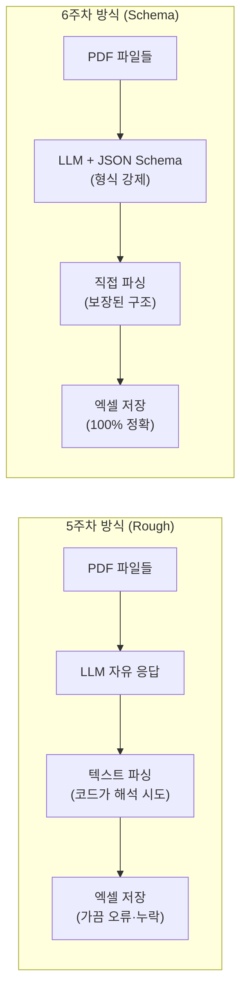

# Week 6 — Structured Output — 빈 칸짜리 양식 채우기

> **이번 주 목표:** 5주차에 배운 텍스트 추출 기술을 한 걸음 더 발전시켜, LLM에게 "정해진 양식(JSON, 표)에 맞춰서 데이터를 정리해달라"고 시키는 프롬프팅 기술을 익힌다.

---

## 💡 핵심 개념: 단순 추출 vs 구조화 출력

지난 5주차의 실습과 과제에서는 문서의 텍스트를 마크다운(글) 형태로 쭉 뽑아보았습니다.
하지만 진짜 실무에서는 "단순히 글을 빼내는 것"보다, 빼낸 데이터를 **엑셀이나 사내 DB 시스템에 넣기 위해 줄을 맞추는 일**이 훨씬 중요합니다.

LLM은 특별한 지시가 없으면 기본적으로 **자유 텍스트**, 즉 사람이 읽기 좋은 줄글로 답합니다. 이 줄글을 다시 엑셀 칸에 옮기는 건 결국 사람 손이 필요합니다.

**Structured Output(구조화 출력)** 은 LLM에게 "줄글 말고, 내가 정해준 형식(JSON이나 표)에만 데이터를 채워넣어"라고 강제하는 프롬프팅 기술입니다. 출력 형식이 보장되면 사람 손 없이 코드나 엑셀로 바로 연결할 수 있습니다.

아래에서 같은 문서에 프롬프트만 다르게 넣었을 때 어떤 차이가 생기는지 직접 확인해보겠습니다.

---

## ❓ 왜 AI는 이런 중괄호 `{}` 형태(JSON)를 가장 좋아할까?

AI에게 데이터를 엑셀 모양으로 요구할 때, 컴퓨터 프로그래머들이 압도적으로 가장 많이 쓰는 포맷이 바로 저 **JSON** 데이터 포맷입니다.
초보자 입장에서는 양쪽에 중괄호 `{ }`가 열리고 닫혀 있고, 따옴표 `""`가 덕지덕지 붙어있는 이 모양새가 다소 복잡하고 어색하게 느껴지실 수 있습니다.

그런데 왜 굳이 컴퓨터나 AI는 이런 낯선 형태를 가장 사랑할까요?

1. **LLM 번역기의 모국어이기 때문**: 전 세계 현대 인터넷 웹사이트나 스마트폰 앱들이 서버와 데이터를 주고받을 때 99.9% 이 JSON 방식을 통일해서 사용합니다. 평생 수억 개의 JSON 데이터를 읽고 학습해 온 AI 입장에서는, 데이터를 가장 명확하게 이해하는 '모국어' 같은 구조입니다.
2. **에러를 꽉 쥐어 틀어막는 튼튼한 괄호**: 컴퓨터 프로그래밍에서는 아주 작은 띄어쓰기 하나로도 프로그램이 오작동으로 죽어버리곤 합니다. 하지만 JSON은 `{` 로 시작해서 `}` 로 끝나고, 각 데이터가 양쪽에 `" "` 로 확실히 감싸져 있기 때문에, 나중에 이를 엑셀로 넘기는 자동화 코드를 붙일 때 컴퓨터가 중간에 헤매지 않고 매우 안전하게 데이터를 쏙쏙 골라 읽어낼 수 있습니다.

처음에는 낯설더라도 **JSON 형태**를 눈에 억지로라도 익혀두시는 것이 이 노코드 자동화 수업의 핵심 치트키가 됩니다.

---

## ⚠️ 실습 데이터와 보안 원칙 (COA, MSDS)

5주차에서 다뤘던 원칙을 다시 짚겠습니다. **민감한 사내 데이터는 외부 Public LLM에 통째로 전송하면 안 됩니다.**

구조화 출력 실습에 쓰기 좋은 실무 문서를 보안 관점에서 정리하면:

- **MSDS (물질안전보건자료)**: 법적으로 외부 공개 의무가 있는 문서입니다. 거래처나 원료명이 포함돼 있어도 보안 리스크가 없어 외부 LLM에 그대로 활용할 수 있습니다.
- **원료 COA (시험성적서)**: 거래처명, 원료명 등 대외비가 포함될 수 있습니다. 이런 문서라면 **민감 정보를 가린(Redacted) 사본**을 쓰거나, 아예 사내 환경에서만 처리하는 파이프라인을 구성해야 합니다. 이 문제는 이번 주 후반부에서 별도로 다룹니다.

---

## 🔬 JSON Schema — "왜 Rough 추출로도 되는데 굳이?"

지난 5주차에서 우리는 이렇게 해봤습니다.

```text
[5주차 방식]
"이 문서에서 순도, 수분, 보관조건 추출해서 output.xlsx에 기록해줘.
4페이지마다 반복되니까 계속 추출해줘."
```

실제로 이게 **잘 됩니다.** LLM이 똑똑하기 때문에 대충 말해도 알아서 해줘요.

그런데 왜 굳이 더 엄격한 구조화 포맷(JSON Schema)을 배워야 할까요?

---

### 📦 택배 상자 비유로 이해하기

택배를 보낼 때를 생각해보세요.

- **가족에게 보낼 때**: 박스에 대충 넣고 "깨지는 거 있으니까 조심해~" 라고 써도 됩니다. 가족이 알아서 꺼내줍니다.
- **쿠팡 물류센터 컨베이어 벨트에 올릴 때**: 정해진 규격 박스, 정해진 위치의 바코드, 정해진 라벨 양식이 **하나라도 어긋나면 기계가 멈춥니다.** 사람이 판단해줄 여지가 없어요.

LLM 출력도 똑같습니다.

| 상황 | 받는 쪽 | Rough 추출 | JSON Schema |
|------|---------|-----------|-------------|
| 나 혼자 오늘 1건 확인 | 내 눈 👀 | ✅ 충분 | 과잉 |
| 매주 20건, 내가 엑셀에 옮김 | 내 손 ✋ | 😓 실수 유발 | ✅ 편함 |
| 100건 자동화, 코드가 읽음 | 파이썬 코드 🤖 | ❌ 파싱 실패 위험 | ✅ 필수 |
| 사내 ERP/DB 시스템 연동 | 회사 시스템 🏢 | ❌ 시스템 오류 | ✅ 유일한 방법 |

**코드가 LLM 출력을 읽는 순간**, 선택지가 사라집니다.

---

### 💥 Rough 추출의 조용한 폭탄

100번 자동화를 돌린다고 가정해봅시다. LLM은 똑똑하지만, 가끔 이런 일이 일어납니다.

```
# 정상 출력 (97번)
{"순도": "98.5%", "수분": "0.5%", "보관조건": "15-25°C"}

# 이상 출력 (3번쯤) — 인사말이 앞에 붙어버림
네, 문서를 분석한 결과 순도는 98.5%이고 수분은 0.5%입니다.
{"순도": "98.5%", "수분": "0.5%", "보관조건": "15-25°C"}

# 또 다른 이상 출력 — 필드명을 영어로 바꿔버림
{"purity": "98.5%", "moisture": "0.5%", "storage": "15-25°C"}

# 최악의 이상 출력 — 타입도 필드명도 멋대로
{"순도": 98.5, "수분함량": "0.5% 이하", "보관": "서늘한 곳"}
```

사람이 보면 다 같은 말이지만, 코드 입장에서는 **완전히 다른 데이터**입니다. `"순도"`를 읽으려던 코드가 `"purity"`를 만나면 그냥 `None`을 반환하고, 조용히 틀린 채로 엑셀에 기록됩니다. **에러도 안 나고 그냥 틀려버립니다.** 이게 가장 위험한 상황이에요.

---

### 📋 JSON Schema — "채점 기준표"를 미리 정해두기

> **프롬프트에 JSON 예시를 넣는 것** = 예시 답안지를 보여주는 것  
> **JSON Schema를 정의하는 것** = 채점 기준표를 강제로 고정하는 것

Schema를 쓰면 LLM이 형식을 어길 수 있는 **가능성 자체를 차단**합니다. 인사말을 붙일 수도, 필드명을 바꿀 수도, 숫자를 문자열로 바꿀 수도 없습니다.

```text
[프롬프트 예시 — Schema 명시 버전]

첨부한 COA 문서에서 아래 항목을 추출해줘.
반드시 아래 JSON Schema 형식만으로 답해. 설명이나 인사말은 절대 포함하지 마.

{
  "type": "object",
  "properties": {
    "순도":     { "type": "string", "description": "% 단위로 표기" },
    "수분":     { "type": "string", "description": "% 단위로 표기" },
    "보관조건": { "type": "string" }
  },
  "required": ["순도", "수분", "보관조건"]
}

항목이 문서에 없으면 값을 null로 표기해.
```

`"required"` 필드에 적힌 항목은 **무조건 응답에 포함**되어야 하며, `"type"`을 명시하면 숫자/문자열 형식도 강제됩니다.

Gemini API를 코드로 쓸 때는 `response_schema` 파라미터로 이걸 넘기면 API 수준에서 형식을 강제할 수 있습니다. 이 부분은 다음 Vibe Coding 실습에서 바로 이어집니다.

---

## 1. 프롬프트로 JSON 구조 강제하기

같은 COA 문서를 첨부하고, 프롬프트만 다르게 넣어보면 LLM의 응답이 완전히 달라집니다.

{::nomarkdown}
<div style="display:flex; gap:16px; margin:20px 0;">

  <div style="flex:1; border:1.5px solid #d0d0d0; border-radius:8px; padding:16px; background:#fafafa;">
    <div style="font-weight:bold; color:#888; margin-bottom:10px;">❌ 일반 프롬프트 (형식 미지정)</div>
    <div style="font-size:0.85em; color:#555; background:#f0f0f0; border-radius:4px; padding:8px; margin-bottom:12px;">
      "이 COA에서 순도, 수분함량, 보관조건 알려줘."
    </div>
    <div style="font-size:0.88em; line-height:1.7; color:#333;">
      안녕하세요! 첨부하신 COA 문서를 검토한 결과,
      해당 원료의 순도는 <strong>98.5% 이상</strong>으로 확인됩니다.
      수분 함량의 경우 <strong>0.5% 이하</strong>를 만족하며,
      보관 조건은 서늘하고 건조한 곳(15~25°C)에 보관하도록
      명시되어 있습니다. 추가로 궁금하신 사항이 있으시면
      편하게 말씀해 주세요! 😊
    </div>
    <div style="margin-top:12px; font-size:0.8em; color:#c0392b; font-weight:bold;">
      → 항목은 맞지만 자연어 출력 — 코드나 엑셀에 바로 쓸 수 없음
    </div>
  </div>

  <div style="flex:1; border:1.5px solid #1F5795; border-radius:8px; padding:16px; background:#f0f4f9;">
    <div style="font-weight:bold; color:#1F5795; margin-bottom:10px;">✅ 구조화 프롬프트 (JSON Schema 지정)</div>
    <div style="font-size:0.85em; color:#555; background:#e8eef5; border-radius:4px; padding:8px; margin-bottom:12px;">
      "아래 JSON Schema 형식으로만 답해. 인사말 금지.<br>
      {"type":"object","properties":{"순도":{"type":"string"},"수분함량":{"type":"string"},"보관조건":{"type":"string"}},"required":["순도","수분함량","보관조건"]}"
    </div>
    <pre style="font-size:0.85em; background:#fff; border:1px solid #c8d8ea; border-radius:4px; padding:10px; margin:0; line-height:1.6;">{
  "순도": "98.5% 이상",
  "수분함량": "0.5% 이하",
  "보관조건": "15-25°C, 차광 보관"
}</pre>
    <div style="margin-top:12px; font-size:0.8em; color:#1F5795; font-weight:bold;">
      → 필드명·형식 보장 — 코드가 바로 읽고 엑셀에 바로 쓸 수 있음
    </div>
  </div>

</div>
{:/nomarkdown}

아무런 코딩 없이 여러분이 쓰시는 ChatGPT 혹은 Claude 창을 엽니다.
준비된 COA 문서를 첨부하고, 아래 프롬프트를 그대로 입력해보세요.

```text
[프롬프트 예시]

첨부한 문서(COA)에서 데이터를 추출해 줘.
반드시 아래와 같은 JSON 형식으로만 답해. 부가적인 인사말이나 설명은 절대 포함하지 마.

추출해야 할 항목(JSON 양식):
{
    "CAS번호": "...",
    "순도": "...",
    "외관": "...",
    "보관조건": "...",
    "위험성_경고": "..."
}

만약 문서에 해당 정보가 없다면 값에 "null" 이라고 대신 적어줘.
```

**결과 확인:**
LLM이 어떠한 인사말이나 부연 설명도 없이, 딱 우리가 요구한 저 양식 모양 그대로 반환했다면 대성공입니다. 향후 파이썬 프로그램이 이 텍스트를 발견하면 그 즉시 0.1초 만에 엑셀 파일로 바꿔버릴 수 있습니다.

---

## 2. 엑셀로 당장 붙여넣기 가장 편한 마크다운 표(Table) 형태

파이썬 코드 없이 "지금 당장 엑셀에 넣어야 한다"는 상황이라면 **마크다운 표(Table)** 형태 요청이 가장 빠릅니다.

### 🧾 실습 시나리오 — 시약·소모품 구매 영수증 정리

분기마다 반복되는 상황을 생각해보세요.

> 폴더에 PDF 영수증 5장이 있습니다.  
> 각 파일을 열어서 날짜, 거래처, 금액을 엑셀에 옮겨야 합니다.  
> 지금까지는 PDF를 하나씩 열고 눈으로 읽으며 타이핑했습니다.

실습용 PDF 5장(`RCP-2024-0312` ~ `RCP-2024-0408`)을 Claude나 ChatGPT에 **한 번에 첨부**하고 아래 프롬프트를 그대로 넣어보세요.

```text
[프롬프트 예시]

첨부한 PDF 영수증 파일들을 읽고, 아래 컬럼 구조로 통합 표 하나를 만들어줘.
표 형식: 마크다운 테이블

컬럼 구성:
| 영수증번호 | 날짜 | 거래처 | 품목요약 | 합계금액(원) | 비고 |

규칙:
- 품목요약은 주요 품목 1~2개만 간략히 적어줘 (예: "Ethanol 외 2종")
- 합계금액은 숫자만, 쉼표 포맷으로 (예: 101,700)
- 표 외의 설명이나 인사말은 절대 포함하지 마
- 데이터가 없는 칸은 비워둬
```

**LLM이 반환하는 결과물:**

```
| 영수증번호    | 날짜          | 거래처              | 품목요약            | 합계금액(원) | 비고                  |
|-------------|-------------|-------------------|-------------------|------------|---------------------|
| RCP-2024-0312 | 2024년 3월 12일 | 시그마알드리치 코리아 | Ethanol 외 2종     | 101,700    | 원료 안정성 테스트용   |
| RCP-2024-0318 | 2024년 3월 18일 | 엔바이오테크         | 마이크로튜브 외 2종  | 83,300     | 실험 소모품 정기 구매  |
| RCP-2024-0325 | 2024년 3월 25일 | 바이오메드코리아      | Hyaluronic Acid 외 | 194,000    | 신규 원료 소량 구매   |
| RCP-2024-0401 | 2024년 4월 1일  | 신성사이언스          | 증류수 외 3종       | 141,800    | 기기 유지보수 및 소모품 |
| RCP-2024-0408 | 2024년 4월 8일  | 시그마알드리치 코리아 | Glycerin 외 2종    | 149,500    | Q2 제형 연구 원료     |
```

이 표 전체를 마우스로 드래그해서 복사한 뒤, **빈 엑셀의 A1 셀에 붙여넣기(Ctrl+V)** 하면 각 컬럼이 셀 칸칸으로 자동 분리되어 들어갑니다.

> 💡 **실습 자료**: 강의 자료 폴더의 `receipt_template.csv`를 엑셀로 열면 헤더가 미리 잡혀 있습니다. 여기에 LLM 결과를 A2 셀부터 붙여넣으면 됩니다.

---

### 📌 표 형태 vs JSON — 언제 뭘 쓸까?

| 상황 | 추천 형태 |
|------|-----------|
| 지금 당장 내가 엑셀에 붙여넣기 | **마크다운 표** |
| 코드가 데이터를 읽어서 처리 | **JSON (Schema 포함)** |
| 팀원과 공유, 가공 없이 보고서로 | **마크다운 표** |
| 100건 이상 자동화 파이프라인 | **JSON (Schema 포함)** |

두 형태 모두 "구조화 출력"입니다. 받는 쪽이 사람이냐 코드냐에 따라 선택이 달라질 뿐입니다.

---

## 🔒 COA 비밀문서, 어떻게 실습에 쓸까?

원료 COA(시험성적서)는 실무에서 구조화 출력의 핵심 대상이지만, 동시에 **회사 기밀**이 담겨 있습니다. 외부 LLM 서비스에 그대로 올리기엔 찜찜하죠.

그런데 생각해보면, 우리가 LLM에 넘기고 싶은 건 **표의 숫자와 항목명**이지, 거래처 이름이나 회사 로고가 아닙니다.

---

### 🤔 스스로 생각해보기

COA를 안전하게 쓰려면 어떤 제약 조건을 해결해야 할까요?

**제약 조건 1.** 원본 PDF를 통째로 외부 LLM에 올리면 안 된다  
**제약 조건 2.** 그렇다고 텍스트만 긁으면 표 구조나 이미지 정보가 날아갈 수 있다  
**제약 조건 3.** 가려야 할 위치와 범위가 문서마다 다를 수 있다  
**제약 조건 4.** 수십 장을 매번 수작업으로 처리하면 자동화 의미가 없다  

이 네 가지를 동시에 만족하는 방법이 있을까요?  
AI에게 이 제약 조건들을 그대로 설명하고, 어떤 접근법이 가능한지 먼저 물어보세요. 여러분이 직접 생각하기 전에 AI가 어떤 아이디어들을 내놓는지 확인해보는 것도 좋은 출발점입니다.

```text
[AI에게 물어볼 프롬프트 예시]

나는 회사 원료 COA 문서를 LLM으로 자동 처리하고 싶어.
그런데 COA에는 거래처명, 회사 로고 등 기밀 정보가 포함되어 있어서
외부 AI 서비스에 통째로 올릴 수가 없어.

내가 필요한 건 표 안의 수치 데이터(순도, 수분, 보관조건 등)만이야.
이 제약 조건을 지키면서 자동화할 수 있는 방법이 뭐가 있을까?
장단점이랑 구현 난이도도 같이 알려줘.
```

AI가 제안하는 방법들을 보면서, 우리 팀 상황(문서 규격이 일정한지, 담당자가 매번 검토하는지)에 맞는 방법을 직접 골라보세요.

{::nomarkdown}
<details>

<summary>💡 힌트 — 한 가지 접근 방향 예시 (먼저 스스로 생각해본 후 펼쳐보세요)</summary>

<br>

<p>한 가지 가능한 흐름을 소개합니다. 이게 정답은 아니고, 여러 방법 중 하나입니다.</p>

<p><strong>[PDF → 이미지 변환 → 민감 영역 마스킹 → LLM Vision 추출]</strong></p>

<pre><code>① PDF 페이지를 이미지(PNG)로 변환
   └ 5주차에 배운 pdfplumber/pymupdf로 가능
   └ 텍스트 레이어가 없는 스캔본도 이미지로 변환하면 동일하게 처리 가능

② 이미지에서 기밀 영역(거래처명, 로고)을 흰 박스로 덮기
   └ 마스킹할 좌표를 미리 지정해두거나,
     GUI 화면에서 드래그로 영역을 선택하는 방식도 생각해볼 수 있음

③ 마스킹된 이미지를 Gemini Vision에 넘겨 구조화 추출
   └ 이번 주에 배운 JSON Schema를 적용하면
     표 데이터만 깔끔하게 뽑아낼 수 있음</code></pre>

<p><strong>이 방식에서 추가로 고민해볼 점:</strong></p>
<ul>
  <li>대부분의 COA는 비슷한 양식이지만, 가끔 양식이 튀는 거래처가 있을 때 마스킹 좌표를 어떻게 관리할지</li>
  <li>텍스트 PDF와 스캔 이미지 삽입본이 섞여 있는 경우, 두 케이스를 하나의 파이프라인으로 처리할 수 있을지</li>
  <li>GUI로 영역을 지정하는 도구를 Vibe Coding으로 만들어달라고 하면 어떤 형태가 나올지</li>
</ul>

<p>결국 어떤 방법이 최선인지는 <strong>실제 거래처별 COA 양식이 얼마나 일정한지, 스캔본의 비율이 얼마나 되는지</strong>에 달려 있습니다.</p>

</details>
{:/nomarkdown}

---

## 3. 5주차에서 6주차로 — "되던 것"이 "보장되는 것"으로

5주차에서 우리는 이미 PDF 여러 장을 자동으로 처리하는 앱을 만들었습니다. 실제로 잘 작동했어요.

그렇다면 6주차에서 배우는 Structured Output은 뭘 더하는 걸까요?

> 5주차: **작동합니다.** 40장도 처리됩니다.  
> 6주차: **보장됩니다.** 400장도, ERP 연동도, 팀 공유 파이프라인도 가능해집니다.

차이는 **코드가 출력을 얼마나 신뢰할 수 있느냐**입니다.

---

### 🔄 두 방식의 파이프라인 비교



5주차 파이프라인이 **97번은 맞고 3번은 틀려도** 40장 규모에서는 그냥 넘어갈 수 있었습니다. 틀린 3장을 눈으로 확인하면 되니까요.

하지만 400장이 되는 순간, 틀린 12장을 찾아내는 것 자체가 새로운 노가다가 됩니다. ERP 시스템에 자동 입력하는 파이프라인이라면, 조용히 틀린 채로 들어간 데이터는 아예 발견조차 못할 수 있습니다.

---

### 🛠️ 5주차 앱을 업그레이드하는 Vibe Coding 프롬프트

5주차에서 만든 PDF 처리 앱을 그대로 열고, AI에게 이렇게 지시하세요.

```text
[Vibe Coding 프롬프트 예시]

5주차에 만든 PDF 파서 앱이 있어.
지금은 PDF 내용을 자유 텍스트로 뽑아내는데,
이걸 JSON Schema 방식으로 업그레이드하고 싶어.

추출할 항목은 이거야:
- 영수증번호
- 날짜  
- 거래처
- 품목요약 (주요 품목 1~2개)
- 합계금액 (숫자만)
- 비고

조건:
1. google-genai의 response_schema 파라미터를 써서 형식을 강제해줘
2. 폴더 안의 PDF를 순서대로 전부 처리해서
3. 결과를 하나로 합쳐 "통합_정산.xlsx"로 저장해줘
4. 파이썬 초보도 실행할 수 있게 실행 방법도 알려줘
```

이 한 번의 지시로 5주차 앱이 **형식이 보장된 자동화 머신**으로 바뀝니다.

---

## ✅ 이번 주 체크리스트

- [ ] 일반 텍스트 추출과, JSON/Table 구조화 출력(Structured Output)의 가장 결정적인 차이점(자동 시스템 연동 여부)을 깨닫기
- [ ] 왜 컴퓨터 세계에서 직관성이 좀 떨어지는 JSON 포맷의 위상이 절대적인지 공감하기
- [ ] 보안 걱정이 없는(원료명 블라인드 등) 진짜 실무 문서 파일들을 직접 준비하고 생생하게 실습해 보기
- [ ] 출력된 표 데이터를 마우스로 직접 엑셀 셀 안에 복사/붙여넣기 해보시면서 완벽하게 표 텍스트가 엑셀로 호환되어 들어가는 쾌감을 직접 경험하기

---

## 🔗 다음 주 예고

Week 7에서는 웹 페이지에서 원하는 데이터를 자동으로 뽑아오는 **웹 스크래핑**을 다룹니다.

BeautifulSoup, Selenium 같은 라이브러리 사용법을 외울 필요 없습니다. LLM에게 코드를 짜달라고 하면 됩니다.

다만 한 가지 알아두면 좋은 점이 있습니다. LLM이 스크래핑 코드를 정확하게 만들려면 해당 페이지의 HTML 구조를 알아야 합니다. 단순히 URL만 전달하면 LLM이 구조를 추측해서 코드를 짜기 때문에 실제 실행했을 때 빈 결과가 나오는 경우가 많습니다. 브라우저에서 HTML을 복사해서 같이 전달하는 방법, 그리고 DevTools로 원하는 데이터가 어느 위치에 있는지 확인하는 방법을 함께 배웁니다.
